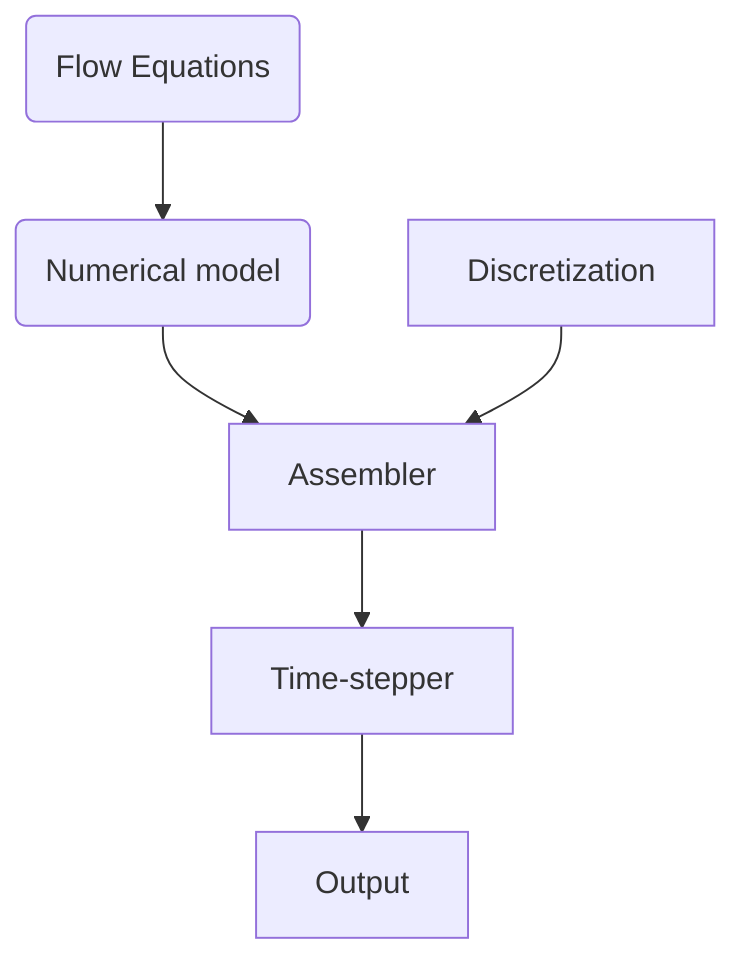
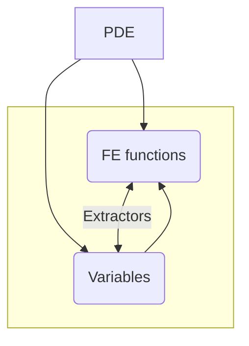

---
# You can also start simply with 'default'
theme: seriph
# random image from a curated Unsplash collection by Anthony
# like them? see https://unsplash.com/collections/94734566/slidev
background: /bckp.jpg
#https://cover.sli.dev
# some information about your slides (markdown enabled)
title: Introduction to DiFfRG
info: |
  ## DiFfRG introduction

# apply unocss classes to the current slide
class: text-center
# https://sli.dev/features/drawing
drawings:
  persist: false
# slide transition: https://sli.dev/guide/animations.html#slide-transitions
transition: slide-left
# enable MDC Syntax: https://sli.dev/features/mdc
mdc: true
# open graph
# seoMeta:
#  ogImage: https://cover.sli.dev
addons:
  - "slidev-addon-stem"
  - fancy-arrow
---


<div style="margin-top:2cm;">

# A Brief Introduction to DiFfRG

Franz R. Sattler

May 2025

<a href="https://github.com/satfra/DiFfRG-introduction">
<svg xmlns="http://www.w3.org/2000/svg" viewBox="0 -3600 15872 16384">
  <path d="M165.9 397.4c0 2-2.3 3.6-5.2 3.6-3.3 .3-5.6-1.3-5.6-3.6 0-2 2.3-3.6 5.2-3.6 3-.3 5.6 1.3 5.6 3.6zm-31.1-4.5c-.7 2 1.3 4.3 4.3 4.9 2.6 1 5.6 0 6.2-2s-1.3-4.3-4.3-5.2c-2.6-.7-5.5 .3-6.2 2.3zm44.2-1.7c-2.9 .7-4.9 2.6-4.6 4.9 .3 2 2.9 3.3 5.9 2.6 2.9-.7 4.9-2.6 4.6-4.6-.3-1.9-3-3.2-5.9-2.9zM244.8 8C106.1 8 0 113.3 0 252c0 110.9 69.8 205.8 169.5 239.2 12.8 2.3 17.3-5.6 17.3-12.1 0-6.2-.3-40.4-.3-61.4 0 0-70 15-84.7-29.8 0 0-11.4-29.1-27.8-36.6 0 0-22.9-15.7 1.6-15.4 0 0 24.9 2 38.6 25.8 21.9 38.6 58.6 27.5 72.9 20.9 2.3-16 8.8-27.1 16-33.7-55.9-6.2-112.3-14.3-112.3-110.5 0-27.5 7.6-41.3 23.6-58.9-2.6-6.5-11.1-33.3 2.6-67.9 20.9-6.5 69 27 69 27 20-5.6 41.5-8.5 62.8-8.5s42.8 2.9 62.8 8.5c0 0 48.1-33.6 69-27 13.7 34.7 5.2 61.4 2.6 67.9 16 17.7 25.8 31.5 25.8 58.9 0 96.5-58.9 104.2-114.8 110.5 9.2 7.9 17 22.9 17 46.4 0 33.7-.3 75.4-.3 83.6 0 6.5 4.6 14.4 17.3 12.1C428.2 457.8 496 362.9 496 252 496 113.3 383.5 8 244.8 8zM97.2 352.9c-1.3 1-1 3.3 .7 5.2 1.6 1.6 3.9 2.3 5.2 1 1.3-1 1-3.3-.7-5.2-1.6-1.6-3.9-2.3-5.2-1zm-10.8-8.1c-.7 1.3 .3 2.9 2.3 3.9 1.6 1 3.6 .7 4.3-.7 .7-1.3-.3-2.9-2.3-3.9-2-.6-3.6-.3-4.3 .7zm32.4 35.6c-1.6 1.3-1 4.3 1.3 6.2 2.3 2.3 5.2 2.6 6.5 1 1.3-1.3 .7-4.3-1.3-6.2-2.2-2.3-5.2-2.6-6.5-1zm-11.4-14.7c-1.6 1-1.6 3.6 0 5.9 1.6 2.3 4.3 3.3 5.6 2.3 1.6-1.3 1.6-3.9 0-6.2-1.4-2.3-4-3.3-5.6-2z"/>
</svg>
</a>

</div>


<!--
<div @click="$slidev.nav.next" class="mt-12 py-1" hover:bg="white op-10">
  Press Space for next page <carbon:arrow-right />
</div>

<div class="abs-br m-6 text-xl">
  <button @click="$slidev.nav.openInEditor()" title="Open in Editor" class="slidev-icon-btn">
    <carbon:edit />
  </button>
  <a href="https://github.com/slidevjs/slidev" target="_blank" class="slidev-icon-btn">
    <carbon:logo-github />
  </a>
</div>
-->

<!--
The last comment block of each slide will be treated as slide notes. It will be visible and editable in Presenter Mode along with the slide. [Read more in the docs](https://sli.dev/guide/syntax.html#notes)
-->

---
layout: intro
transition: slide-left
---

# What is DiFfRG?


Library of tools to solve *functional RG flows*

$$ %{1|3|all}
\begin{aligned}
\partial_t \Gamma[\Phi] = \frac{1}{2}\textrm{STr}\,\frac{1}{\Gamma^{(2)}[\Phi] + R_k}\partial_t R_k
\end{aligned}
$$

- <mdi-calculator-variant/>    **Derivation & Code Generation** in Mathematica.
- <mdi-math-integral/>    **Loop integration** GPU & CPU parallelized.
- <mdi-grid-large/>    **Finite Element Methods** for full field dependences.
- <mdi-run-fast/>    **Timestepping** for high efficiency.
<br>
<br>

<!--
You can have `style` tag in markdown to override the style for the current page.
Learn more: https://sli.dev/features/slide-scope-style
-->

<style>
h1 {
  background-color: #2B90B6;
  background-image: linear-gradient(45deg, #4EC5D4 10%, #146b8c 20%);
  background-size: 100%;
  -webkit-background-clip: text;
  -moz-background-clip: text;
  -webkit-text-fill-color: transparent;
  -moz-text-fill-color: transparent;
}
</style>

<!--
Here is another comment.
-->


---
layout: default
transition: fade-out
---

<div class="grid grid-cols-[66%_34%] gap-3">
  <div>

# Setting up an fRG <mdi-waves-arrow-right/> with DiFfRG
The overall structure of a simulation using DiFfRG

```cpp {none|1|1-4|1-4,6|all|1}{at:2}
Model model(json);
RectangularMesh<dim> mesh(json);
Discretization discretization(mesh, json);
Assembler assembler(discretization, model, json);
DataOutput<dim, VectorType> data_out(json);
TimeStepper time_stepper(json, &assembler, &data_out);
```

<v-clicks>

1. Derive **flow equations** and put them to C++.

2. Describe the 
<span v-mark.undeline.red="7">**PDE structure**</span>
in the 
<span v-mark.circle.orange="6">**numerical model**</span>.

3. Give the numerical model and a **disretization** to the **assembler** to construct the PDE system.

4. Give the assembler to a **time-stepper** to integrate the PDE.

5. The time-stepper generates *output* to be analyzed.

</v-clicks>

  </div>
  <div class="items-center">

  </div>
</div>

---
layout: default
transition: none
---

<div class="grid grid-cols-[72%_28%] gap-4">
  <div>

# Data structure

DiFfRG treats vertex expansions and field expansions separately

<v-click>

- Field dependent quantities: 
$$\partial_t u(\rho) + \partial_\rho F(u,u',...) + s(u,u',...) = 0$$
&nbsp;&nbsp;&nbsp;&nbsp;&nbsp;&nbsp;<mdi-arrow-right-bold/> $u(\rho)$ is a vector of *FE functions*.
</v-click>
<v-click>

- Vertex expansions:
$$\partial_t v + \textrm{Flow}[v](v, u\vert_\textrm{EoM}, ...)$$
&nbsp;&nbsp;&nbsp;&nbsp;&nbsp;&nbsp;<mdi-arrow-right-bold/> $v$ is a vector of *variables*.
</v-click>
<v-click>

- Extractors read out $e(u\vert_\textrm{EoM}, ...)$ and provide it to both sectors.

&nbsp;&nbsp;&nbsp;&nbsp;&nbsp;&nbsp;<mdi-arrow-right-bold/> Extractors communicate from FE functions to variables.
</v-click>

</div>
<div>

&nbsp;


</div>
</div>

---
layout: default
transition: slide-left
---

<div class="grid grid-cols-[72%_28%] gap-4">
  <div>

# Data structure

DiFfRG treats vertex expansions and field expansions separately

````md magic-move {lines: true}

```cpp
using FEFunctions = FEFunctionDescriptor<Scalar<"u">>;
using Components = ComponentDescriptor<FEFunctionDesc>;
```

```cpp
using FEFunctions = FEFunctionDescriptor<Scalar<"u">>;
using Components = ComponentDescriptor<FEFunctionDesc>;

// create an index map for FE functions
constexpr FEFunctions idxf{};

//...

// idxf("u") returns 0
F_i[idxf("u")] = ...;
```

```cpp
using FEFunctions = FEFunctionDescriptor<Scalar<"u">>;
using Variables = VariableDescriptor<Scalar<"ZPhi", 32>>;
using Extractors = ExtractorDescriptor< Scalar<"rhoPhi">, ...>;
using Components = ComponentDescriptor<FEFunctions, Variables, Extractors>;
```

```cpp
using FEFunctions = FEFunctionDescriptor<Scalar<"u">>;
using Variables = VariableDescriptor<FunctionND<"ZPhi", 32>, Scalar<"Y">>;
using Extractors = ExtractorDescriptor<Scalar<"rhoPhi">, ...>;
using Components = ComponentDescriptor<FEFunctions, Variables, Extractors>;

// create a index maps
constexpr FEFunctions idxf{};
constexpr Variables idxv{};
constexpr Extractors idxe{};

//...

  const auto rhoPhi = extractors[idxe("rhoPhi")];
  // idxv("Y") returns 32
  dt_v[idxv("Y")] = ...;

//...

// idxf("u") returns 0
  F_i[idxf("u")] = ...;
```
````

</div>
<div>

&nbsp;


</div>
</div>

---
layout: fact
transition: fade-out
---
  
<span class="text-5xl font-bold" color="blue">Example:</span> 

<span class="text-4xl font-bold">O(N) model</span> 


&nbsp;

$$
\Gamma[\phi] = \int_x \left(
  \frac{1}{2}\partial_\mu\phi(x)\partial_\mu\phi(x) + V_\textrm{eff}(\rho)
\right),
$$

where $\rho = \phi^2/2$ and $\phi = (\sigma, \pi_1, \pi_2, \ldots)$.

&nbsp;
<v-click>
Flow equation: 
$$
\partial_tV_\textrm{eff} = A_d \left[
  \coth\Big(\frac{\sqrt{k^2 + u}}{2T}\Big) 
  + \coth\Big(\frac{\sqrt{k^2 + u + 2\rho u'}}{2T}\Big) 
  \right],
$$
where $A_d = \frac{2\pi^{d/2}}{d (2\pi)^d} \Gamma(d/2)^{-1}$.
</v-click>

---
layout: default
transition: fade-out
---
  
# Hydrodynamics for the fRG
&nbsp;

Note that
$$
\partial_t \Gamma^{(0)}[\Phi] = \textrm{Flow}(\Gamma^{(1)}[\Phi], \Gamma^{(2)}[\Phi])
$$
&nbsp;&nbsp;&nbsp;&nbsp;&nbsp;&nbsp;<mdi-arrow-right-bold/> $\Gamma^{0}[\Phi]$ is irrelevant for flow.

<div style="margin-bottom:7mm;">

For a hydrodynamic formulation, take a derivative wrt. $\rho$ and define $u = V'$:
$$
\partial_t u(\rho, t) = A_d k^5 \partial_\rho\left[
  (N-1)\coth\Big(\frac{\sqrt{k^2 + u}}{2T}\Big) 
  + \coth\Big(\frac{\sqrt{k^2 + u + 2\rho u'}}{2T}\Big) 
  \right]
$$
</div>

<div class="grid grid-cols-[50%_50%] gap-4" style="margin-bottom:7mm;">
<div>
<v-click>
<FancyArrow x1="380" y1="390" x2="450" y2="350" color="blue" arc="0.1" />
<FancyArrow x1="380" y1="390" x2="620" y2="350" color="blue" arc="-0.1"/>

- <span style="color:#528ac4">**Advection**</span>: Prototypical $\partial_t u + c \,\partial_x u = 0$
</v-click>
</div>
<div>
<v-click>
<FancyArrow x1="580" y1="390" x2="780" y2="330" color="red" arc="-0.1" />

- <span style="color:#c9412c">**Diffusion**</span>: Prototypical $\partial_t u + D \,\partial_x^2 u = 0$
</v-click>
</div>
</div>

<v-click>
DiFfRG discretizes with the general form 
<code>mass + <span v-mark.circle.blue="4">flux</span> + source = 0</code> , i.e.
$$
m(\partial_t u, u) + \partial_x F(x, u, ...) + s(x, u, ...) = 0.
$$
</v-click>

---
layout: default
transition: fade-out
---
  
# Hydrodynamics for the fRG
How to discretize $u(\rho,t)$? 

<p style="margin-bottom:6mm;">
DiFfRG discretizes with the general form 
<code>mass + <span v-mark.circle.blue="0">flux</span> + source = 0</code> , i.e.
$$
m(\partial_t u, u) + \partial_x F(x, u, ...) + s(x, u, ...) = 0.
$$
</p>

<v-click>

<div style="margin-bottom:7mm;">
&nbsp;&nbsp;&nbsp;&nbsp;&nbsp;&nbsp;&nbsp;<mdi-arrow-right-bold/> Use a <b>finite element method</b> (FEM) to discretize the PDE.
</div>

<div class="grid grid-cols-[50%_50%] gap-4">
<div>
<ImageFigure
  src="/Example_of_2D_mesh.png"
  caption="Figure 2: A 2D finite element geometry
  [wikipedia.org]."
  width="100%"
  height="240px"
/>
</div>
<div>
<ImageFigure
  src="/DG_geo_1d.png"
  caption="Figure 2: A 1D finite element geometry."
  width="100%"
  height="240px"
/>
</div>
</div>

</v-click>

---
layout: default
transition: slide-left
---
  
# Hydrodynamics for the fRG

Calculate the flow of $u(\rho)$ on an FE discretization:

$$
\partial_t u(\rho, t) = A_d k^5 \partial_\rho\left[
  (N-1)\coth\Big(\frac{\sqrt{k^2 + u}}{2T}\Big) 
  + \coth\Big(\frac{\sqrt{k^2 + u + 2\rho u'}}{2T}\Big) 
  \right]
$$

<div class="grid grid-cols-[65%_35%] gap-4">
  <div>

````md magic-move {lines: true}
```cpp
template <typename NT>
void flux(std::array<Tensor<1, dim, NT>, 1> &flux, 
          const auto &x, const auto &F_i) const
{
  ...
}
```

```cpp
template <typename NT>
void flux(std::array<Tensor<1, dim, NT>, 1> &flux, 
          const auto &x, const auto &F_i) const
{
  ...

  flux[idxf("u")][0] = ...
}
```

```cpp
template <typename NT>
void flux(std::array<Tensor<1, dim, NT>, 1> &flux, 
          const auto &x, const auto &F_i) const
{
  const auto rho = x[0];
  const auto &fe_functions = get<"fe_functions">(sol);
  const auto &fe_derivatives = get<"fe_derivatives">(sol);

  const auto m2Pi = fe_functions[idxf("m2")];
  const auto m2Sigma = fe_functions[idxf("m2")] 
                       + 2 * rho * fe_derivatives[idxf("m2")][0];

  const double A_3 = powr<-1>(6. * powr<2>(M_PI));
  flux[idxf("u")][0] = A_3 * powr<5>(k) * (
    (N-1) * coth(sqrt(k2 + m2Pi)/(2*T)) 
          + coth(sqrt(k2 + m2Sigma)/(2*T)));
}
```
````

</div>
<div>

<v-click>
<ImageFigure
  src="/pXstdSolution.png"
  caption="Figure 1: Evolution of an O(1) theory with SB."
  width="100%"
  height="240px"
  v-motion
  :initial="{
    opacity: 0,
  }"
  :enter="{
    opacity: 1,
    transition: {
      duration: 500,
    },
  }"
/>
</v-click>
</div>
</div>

---
layout: center
transition: slide-left
---

# Run it!

You can find the code in the `Examples/ONfiniteT/` folder of the DiFfRG repository.

- Modify the parameters in the `parameters.json` file.
- Use the `plot.ipynb` notebook to plot the results.
- Draw a phase diagram with the `phasediagram.ipynb` notebook.
- Add a quark flow to the model:
  1. By including it in the `flux` method.
  2. By adding it in the `source` method.

---
layout: center
transition: fade-out
---

# Deriving flow equations
- One can use the `DiFfRG` Mathematica package to derive flow equations.
- During install, DiFfRG has copied its Mathematica package to your Mathematica Applications folder
- Load by using ``Get["DiFfRG`"]``

<v-click>

</v-click>

<style>
img {
  margin-left: auto;
  margin-right: auto;
  padding: 10px 0;
  width: 75%;
}
</style>

---
layout: default
transition: slide-left
---

<div class="grid grid-cols-[37%_63%] gap-3">

<div class="center">

# Typical workflow

<v-clicks>

1. Write down Diagrammatic rules.

2. Set up the truncation with `QMeS`, or `DoFun`.

3. Define *kernels* and *parameters* for C++ code

5. Derive flow equations and project using `TensorBases`.

4. Use `MakeKernel[kernel, parameters, expression]` to generate an *integrator* class.

5. Use `MakeFlowClass[name, kernels]` to generate a class that manages all integrators.
</v-clicks>

</div>

<div style="margin-top:-7mm;" v-click>

## Example:

<v-switch at=6>
<template #1>

Deriving the flow equations for a Gluon propagator:

</template>
<template #2>

And calling them in the model:
```cpp {*}{maxHeight:'450px'}
...

mutable YangMillsFlowEquations flow_equations;

mutable TexLinearInterpolator1D<double, Coordinates1D> dtZc, dtZA, ZA, Zc;
mutable TexLinearInterpolator1D<double, Coordinates1D> ZA4, ZAcbc, ZA3;

void dt_variables(auto &residual, const auto &data) const
{
  const auto &variables = get<"variables">(data);

  // update interpolation functions
  ZA3.update(&variables.data()[idxv("ZA3")]);
  ZAcbc.update(&variables.data()[idxv("ZAcbc")]);
  ZA4.update(&variables.data()[idxv("ZA4")]);

  ...

  // set up arguments for the integrators
  const auto arguments = std::tie(
    ZA3, ZAcbc, ZA4, dtZc, Zc, dtZA, ZA, m2A);

  ...

  // call the integrators for the dressings
  auto futures_ZA3 = request_data<double>(
    flow_equations.ZA3_integrator, grid1D, k, arguments);
  auto futures_ZAcbc = request_data<double>(
    flow_equations.ZAcbc_integrator, grid1D, k, arguments);
  auto futures_ZA4 = request_data<double>(
    flow_equations.ZA4_integrator, grid1D, k, arguments);

  // get all results and write them to residual
  update_data(futures_ZA3, &residual[idxv("ZA3")]);
  update_data(futures_ZAcbc, &residual[idxv("ZAcbc")]);
  update_data(futures_ZA4, &residual[idxv("ZA4")]);

  ...
}
```
</template>
</v-switch>
</div>


<style>
img {
  margin-left: 0px;
  margin-right: 0px;
  padding: 20px 0;
  width: 875px;
  height: 475px;
}
</style>

</div>

---
layout: image-right
transition: slide-left
image: /ZA.png
backgroundSize: contain
---

# Run it!

You can find the code in the `Examples/YangMills/SP/` folder of the DiFfRG repository.

- Modify the parameters in the `parameters.json` file.
- Use the `Yang-Mills.ipynb` notebook to plot the results.
- Play around with the momentum ranges and coupling sizes. Tune to scaling & decoupling.
- Take a look at `Examples/YangMills/Full/` for a larger truncation 
  
  &nbsp; (requires a fast computer, optimally GPU)


---
layout: center
transition: slide-left
---

# Learn More

&nbsp;

- Examples can be found in the <code>Examples/</code> folder of the DiFfRG repository.

- Tutorials can be accessed fromt the [online documentation](https://satfra.github.io/DiFfRG/cpp/TutorialTOC.html), see also the <code>Tutorials/</code> folder.

- An introduction and detailed description can be found in the [DiFfRG paper](https://www.arxiv.org/abs/2412.13043).

---
layout: default
transition: fade-out
---

# Configuration and parameters

````md magic-move {lines: true, at: 1}
```cpp
#pragma once
 
#include <DiFfRG/model/model.hh>
 using namespace DiFfRG;
 
struct Parameters {
  Parameters(const JSONValue &value)
  {
    try {
      Lambda = value.get_double("/physical/Lambda");
      T = value.get_double("/physical/T");
      m2 = value.get_double("/physical/m2");
      lambda = value.get_double("/physical/lambda");
    } catch (std::exception &e) {
      throw std::runtime_error(
        "Error while reading parameters: " + std::string(e.what()));
    }
  }
  double Lambda, T, m2, lambda;
};

using FEFunctionDesc = FEFunctionDescriptor<Scalar<"u">>;
using Components = ComponentDescriptor<FEFunctionDesc>;
constexpr auto idxf = FEFunctionDesc{};
```

````

---
layout: default
transition: fade-out
---
  
# Numerical model setup

<v-switch at=0>
<template #1>
Depending on the assembler, additional methods are required which can be automatically inherited from classes in the `DiFfRG::def` namespace.
</template>
<template #2>
Besides writing the full FE functions, one can also read out data at the EoM and save this data directly to (multiple) CSV files.

</template>
</v-switch>

````md magic-move {lines: true, at: 1}
```cpp
using namespace DiFfRG;

class ON_finiteT : public def::AbstractModel<ON_finiteT, Components>,
                   public def::fRG,                        // this handles the fRG time
                   public def::LLFFlux<ON_finiteT>,        // use a LLF numflux
                   public def::FlowBoundaries<ON_finiteT>, // use Inflow/Outflow boundaries
                   public def::AD<ON_finiteT>              // define all jacobians per AD
{
public:
  const Parameters prm;

  ON_finiteT(const JSONValue &json) : def::fRG(json.get_double("/physical/Lambda")), prm(json) {}

  void initial_condition(const Point<1> &pos, auto &values) const
  {
    const auto rho = pos[0];
    values[idxf("m2")] = prm.m2 + prm.lambda / 2. * rho;
  }
  ...
};
```

```cpp
template <typename DataOut> 
void readouts(DataOut &output, const Point<dim> &x, const auto &sol) const
{
  const auto &fe_functions = get<"fe_functions">(sol);
  const auto &fe_derivatives = get<"fe_derivatives">(sol);

  const double rho = x[0];
  const double sigma = std::sqrt(2. * rho);

  const double m2Pi = fe_functions[idxf("m2")];
  const double m2Sigma = fe_functions[idxf("m2")] + 2. * rho * fe_derivatives[idxf("m2")][0];

  auto &out_file = output.csv_file("data.csv");
  out_file.set_Lambda(Lambda);

  out_file.value("sigma [GeV]", sigma);
  out_file.value("m^2_{pi} [GeV^2]", m2Pi);
  out_file.value("m^2_{sigma} [GeV^2]", m2Sigma);
}
```
````

---
layout: default
transition: fade-out
---

# Putting it all together

<div style="overflow-y: scroll; height:430px;">
```cpp
#include <DiFfRG/common/configuration_helper.hh>
#include <DiFfRG/common/utils.hh>
#include <DiFfRG/discretization/discretization.hh>
#include <DiFfRG/timestepping/timestepping.hh>

#include "model.hh"

using namespace dealii;
using namespace DiFfRG;

// Choices for types
using Model = ON_finiteT;
constexpr uint dim = 1;
using Discretization = CG::Discretization<Model::Components, double, RectangularMesh<dim>>;
using VectorType = typename Discretization::VectorType;
using SparseMatrixType = typename Discretization::SparseMatrixType;
using Assembler = CG::Assembler<Discretization, Model>;
using TimeStepper = TimeStepperSUNDIALS_IDA<VectorType, SparseMatrixType, dim, UMFPack>;

int main(int argc, char *argv[])
{
  // get all needed parameters and parse from the CLI
  ConfigurationHelper config_helper(argc, argv);
  const auto json = config_helper.get_json();

  // Define the objects needed to run the simulation
  Model model(json);
  RectangularMesh<dim> mesh(json);
  Discretization discretization(mesh, json);
  Assembler assembler(discretization, model, json);
  DataOutput<dim, VectorType> data_out(json);
  TimeStepper time_stepper(json, &assembler, &data_out);

  // Set up the initial condition
  FE::FlowingVariables initial_condition(discretization);
  initial_condition.interpolate(model);

  // Now we start the timestepping
  Timer timer;
  try {
    time_stepper.run(&initial_condition, 0., json.get_double("/timestepping/final_time"));
  } catch (std::exception &e) {
    spdlog::get("log")->error("Simulation finished with exception {}", e.what());
    return -1;
  }
  auto time = timer.wall_time();
  assembler.log("log");
  spdlog::get("log")->info("Simulation finished after " + time_format(time));
  return 0;
}
```
</div>

